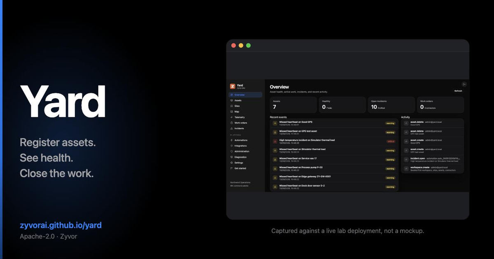
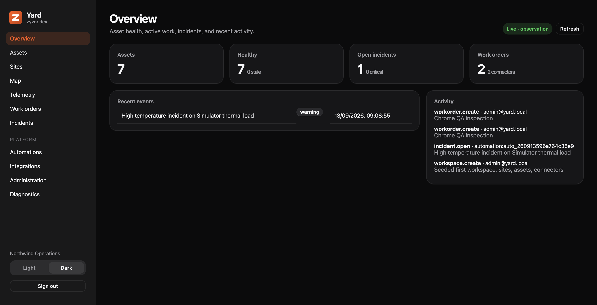
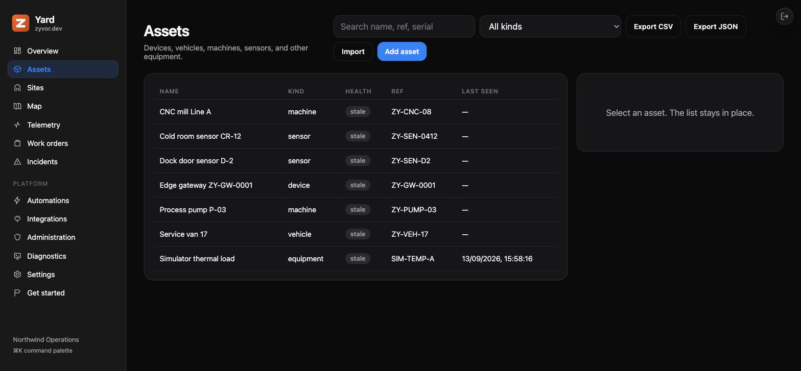
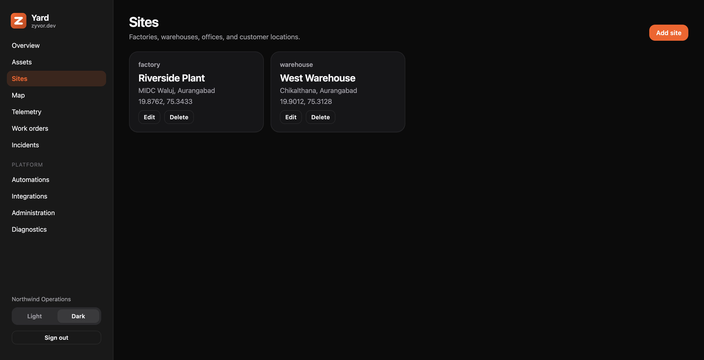
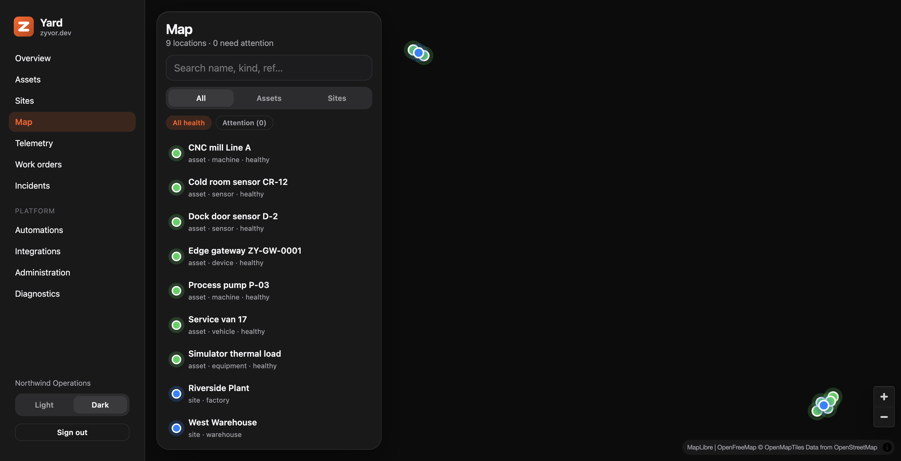
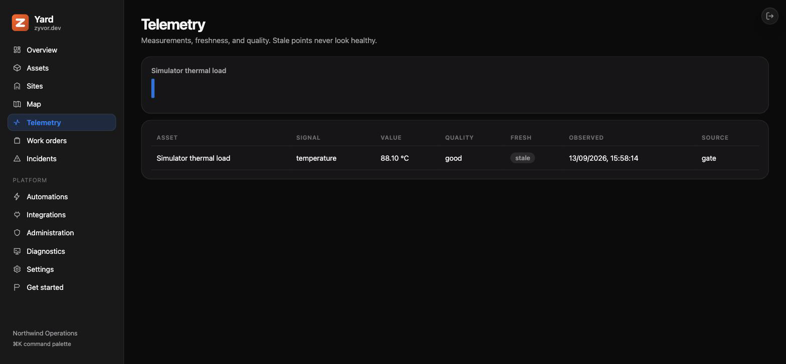
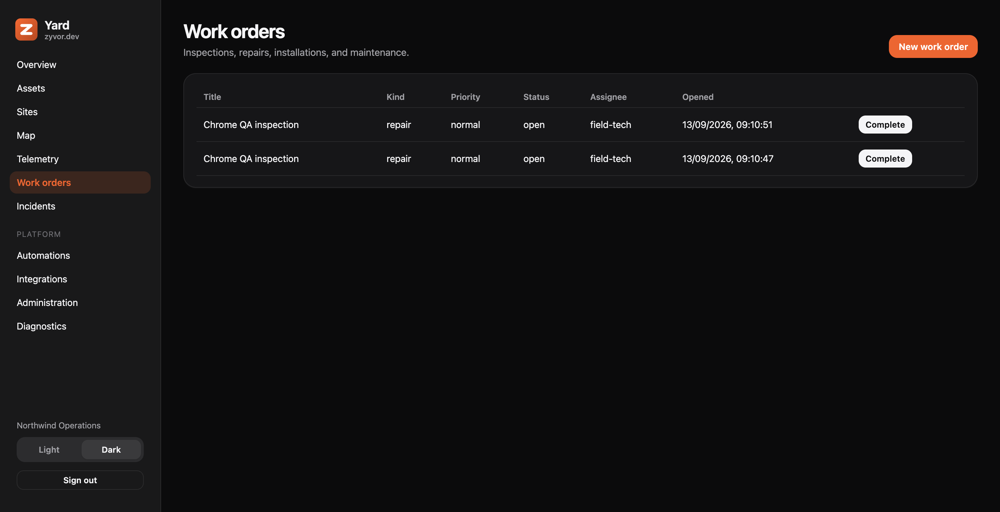
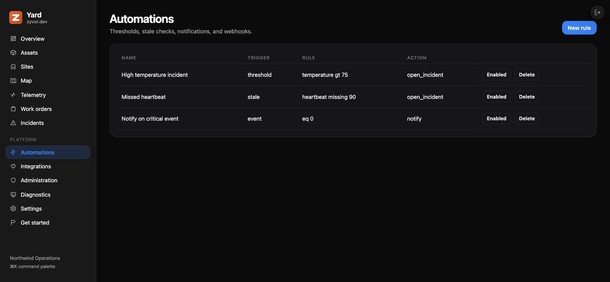

# Yard

[](https://github.com/zyvorai/yard/actions/workflows/ci.yml)
[](LICENSE)
[](https://zyvorai.github.io/yard/)
[](go.mod)
[](web/package.json)



**Open asset and operations platform — devices, sites, telemetry, incidents, and work orders. Zyvor connectors are optional. Yard runs alone.**

📖 **[Read the full docs](https://zyvorai.github.io/yard/)** — quickstart, architecture, console features, API, security, and a product tour.

**[Quick start](#quick-start)** · **[Product tour](https://zyvorai.github.io/yard/tour)** · **[Compare](https://zyvorai.github.io/yard/compare)** · **[Full docs](https://zyvorai.github.io/yard/)**

Yard is a standalone registry for physical operations. A device is one asset kind; vehicles, machines, sensors, and equipment share the same model. Device Agent, Nodra, Fleet, and OTA plug in when you need them — you can install Yard without installing anything else in the Zyvor suite.

Yard stays honest when data goes quiet: observations carry source, unit, quality, and timestamps; missed heartbeats mark assets **stale** rather than healthy; automations open incidents with severity policies and runbooks so operators know what to do next.



## Contents

- [Dashboard gallery](#dashboard-gallery)
- [What Yard does](#what-yard-does)
- [Live ops and automations](#live-ops-and-automations)
- [Registry, map, and bulk IO](#registry-map-and-bulk-io)
- [Incidents, severity policies, and runbooks](#incidents-severity-policies-and-runbooks)
- [Boundaries](#boundaries)
- [Architecture](#architecture)
- [Repository](#repository)
- [Prerequisites](#prerequisites)
- [Quick start](#quick-start)
- [Data model](#data-model)
- [Interface](#interface)
- [Tests](#tests)
- [Docs and roadmap](#docs-and-roadmap)
- [License](#license)

## Dashboard gallery

Live UI captures from a lab deployment — not mockups. Overview appears above; the rest of the console:













Full tour: [Product tour](https://zyvorai.github.io/yard/tour) · console how-to: [Console features](https://zyvorai.github.io/yard/docs/guides/console)

## What Yard does

| Module | What users can do |
| --- | --- |
| Overview | Asset health, active work, incidents, recent activity |
| Assets | Register devices, vehicles, machines, sensors, equipment; CSV/JSON import-export |
| Sites | Factories, warehouses, offices, customer locations |
| Map | Clustered locations and stale-or-live status |
| Telemetry | Measurements, freshness, quality, threshold context |
| Work orders | Inspections, repairs, installations, maintenance |
| Incidents | Acknowledge, assign, resolve; severity policies attach runbooks |
| Automations | Notifications, incidents, and webhooks from events |
| Integrations | HTTP ingest, simulator, Device Agent; optional Zyvor connectors |
| Administration | Workspace, severity policies, credentials, audit history |

## Live ops and automations

- Background **stale ticker** marks missed heartbeats without waiting for a page refresh
- Console pages subscribe to `GET /api/v1/stream` (SSE) for live Overview and Map updates
- Optional browser notifications for new **critical** incidents
- Automations: threshold → open incident, stale heartbeat → open incident, notify, or **webhook**
- Create / enable / delete rules in the Automations console
- Remote actions carry idempotency keys, expiry, and audit outcomes

## Registry, map, and bulk IO

- Asset create / edit / delete with capabilities, custom kinds, and site placement
- Site create / edit / delete with lat/lng
- MapLibre full-bleed map with **clustered** GeoJSON pins (click cluster to zoom)
- Bulk **CSV/JSON** export and import (`GET /api/v1/assets/export`, `POST /api/v1/assets/import`) — upsert by `external_ref`
- Onboarding wizard, command palette, and tablet-friendly bottom nav

See [Console features](https://zyvorai.github.io/yard/docs/guides/console) and [API](https://zyvorai.github.io/yard/docs/api).

## Incidents, severity policies, and runbooks

When a threshold or stale automation opens an incident, Yard resolves a **severity policy** (highest priority match):

| Match kind | Example | Effect |
| --- | --- | --- |
| `capability` | `temperature` | severity + runbook for that signal |
| `automation` | `Missed heartbeat` | match by automation name |
| `default` | *(empty value)* | fallback for everything else |

Seeded defaults include a critical temperature runbook and a warning heartbeat checklist. Edit policies under **Administration**; the Incidents detail panel shows the attached runbook. API: `/api/v1/severity-policies`.

## Boundaries

| Component | Responsibility |
| --- | --- |
| **Yard** | Asset registry, sites, workflows, incidents, shared UI |
| **Device Agent** | Hardware discovery, health, local diagnostics |
| **Nodra connector** | Decoded industrial telemetry and buffered events |
| **Zyvor Fleet connector** | Lifecycle requests and progress |
| **OTA connector** | Campaign display; execution stays elsewhere |
| **HTTP / simulator** | Zero-dependency evaluation path |

Device Agent reports physical capability. Nodra interprets protocols. Fleet owns desired state when wired. Yard preserves those lines and adds the operations surface. Full contracts: [docs/CONNECTORS.md](docs/CONNECTORS.md).

## Architecture

```text
                         Browser / curl
                               |
                               v
                    +----------------------+
                    |      cmd/yard        |
                    | API + embedded UI    |
                    | jobs (stale/SSE)     |
                    +----------+-----------+
                               |
                    SQLite / Postgres
                               |
         +---------------------+---------------------+
         |                     |                     |
         v                     v                     v
   HTTP ingest           Included              Device Agent
   (observations /       simulator             gateway
    inventory / events)                        (optional)
         |
         +---- catalog-ready: Nodra · Fleet · OTA ----+
```

## Repository

```text
cmd/yard/              API server + embedded console
cmd/simulator/         included telemetry simulator
cmd/agent-gateway/     Device Agent → Yard ingest bridge
internal/api/          HTTP handlers, RBAC, OpenAPI surface
internal/store/        SQLite / Postgres persistence
internal/jobs/         automations, stale ticker, action sweeper
internal/seed/         demo workspace bootstrap
internal/sse/          live event hub
internal/connectors/   Device Agent dispatch and catalog kinds
web/                   React/Vite console
website/               Docusaurus docs (GitHub Pages)
docs/ROADMAP.md        feature catalog (Have / Next / Later)
docs/CONNECTORS.md     ingest and connector contracts
docs/ux/               live lab screenshots
docs/social/           share / OG card
openapi.yaml           OpenAPI 3.0
scripts/ship           remote lab deploy (Fabric-style)
scripts/backup.sh      SQLite/Postgres backup
scripts/restore.sh     restore a scripts/backup.sh snapshot
```

## Prerequisites

Go 1.22+ and Node 20+ (the docs site build uses Node 22). SQLite ships with the Go standard toolchain via `modernc.org/sqlite` — no CGO, no system SQLite package required. Postgres is optional (`docker compose --profile postgres`). No other services are required to run Yard standalone.

## Quick start

```bash
go run ./cmd/yard
```

Open [http://127.0.0.1:8080](http://127.0.0.1:8080)

```
admin@yard.local
yard-admin
```

In another terminal:

```bash
export YARD_SIMULATOR_TOKEN=$(cat data/simulator.token)
go run ./cmd/simulator
```

First-use path: seeded workspace → simulator (or Device Agent gateway) → discover assets → inspect health → temperature / missed heartbeat opens an incident with severity policy + runbook → assign a work order → record resolution on the asset timeline.

Console development (Vite proxies `/api` to `:8080`):

```bash
cd web && npm install && npm run dev
```

### Docker Compose

```bash
docker compose up --build
```

PostgreSQL is optional (SQLite remains the default for `go run` and CI):

```bash
docker compose --profile postgres up --build
# Yard on :8081 with YARD_DATABASE_URL=postgres://...
```

### Remote lab deploy

Same one-command pattern as Fabric/Nodra — cross-compile locally, install a systemd unit, verify `/healthz`:

```bash
./scripts/ship sus@HOST              # quick redeploy
./scripts/ship sus@HOST --full       # first install + firewall
./scripts/ship sus@HOST --with-sim   # also start the simulator
./scripts/ship sus@HOST --dry-run
```

Open `http://HOST:18080` (default lab port; override with `--port`). Demo login remains `admin@yard.local` / `yard-admin`.

```bash
YARD_URL=http://HOST:18080 ./scripts/verify-remote.sh
```

### Backups

Works against either backend, auto-detected from `YARD_DATABASE_URL` (SQLite via `sqlite3 ... VACUUM INTO`, a live consistent snapshot; Postgres via `pg_dump`/`pg_restore`):

```bash
./scripts/backup.sh                    # snapshot to backups/yard-<timestamp>.db|.dump
./scripts/restore.sh backups/yard-....db   # restores; saves the current file as *.before-restore first
```

### Device Agent gateway

```bash
export YARD_INGEST_TOKEN=$(cat data/ingest.token)
export DEVICE_AGENT_URL=http://127.0.0.1:9188
go run ./cmd/agent-gateway
```

The gateway reads the agent locally and publishes normalized inventory and observations. From Integrations you can also run `inventory.refresh` and `diagnostics.read`. It does not require inbound access to every remote device.

## Data model

Organization · Site · Asset · Capability · Observation · Event ·
WorkOrder · Incident · SeverityPolicy · ActionRequest · Connector ·
Automation

Every observation stores **source**, **unit**, **observed_at**, **received_at**, and **quality**. Severity policies map capability or automation matches to incident severity and runbook text. Remote actions require a session, expire, carry an idempotency key, and record an outcome.

## Interface

Apple-inspired, original identity:

- White and soft-gray surfaces, dark type, generous spacing
- Apple-blue (`#0071e3` / `#0a84ff` in dark mode) for primary actions and selected states; the Zyvor mark keeps its own brand orange
- Compact labeled sidebar; asset detail panel that does not replace the list
- Dark, searchable diagnostics
- System fonts (no CDN), visible focus, reduced-motion support

## Tests

```bash
go test ./...
cd web && npm test
```

Or `make test`. Release gates cover tenant isolation, connector authentication, duplicate observations, stale telemetry, bulk import/export, severity policies, and the health → incident → work order → resolve workflow.

## Docs and roadmap

| Resource | Link |
| --- | --- |
| Product docs | [zyvorai.github.io/yard](https://zyvorai.github.io/yard/) |
| Compare | [Yard Core vs. Zyvor Enterprise](https://zyvorai.github.io/yard/compare) |
| Feature catalog | [docs/ROADMAP.md](docs/ROADMAP.md) |
| Connectors | [docs/CONNECTORS.md](docs/CONNECTORS.md) |
| OpenAPI | [openapi.yaml](openapi.yaml) |
| Security | [SECURITY.md](SECURITY.md) · [docs site](https://zyvorai.github.io/yard/docs/security) |

Shipped epics include live ops (SSE + stale ticker), registry completeness, and Epic 3: bulk CSV/JSON, map clustering, and severity runbooks.

## License

### Open source (Apache-2.0)

This repository is licensed under the [Apache License, Version 2.0](LICENSE).
You may use, modify, and run it for personal, lab, and commercial production
use at no charge, subject to Apache-2.0 (preserve notices / NOTICE where required).

### Enterprise

Production support, SLAs, and Zyvor Enterprise products are licensed separately.
Contact [sales@zyvor.dev](mailto:sales@zyvor.dev) or see [zyvor.dev](https://zyvor.dev).
