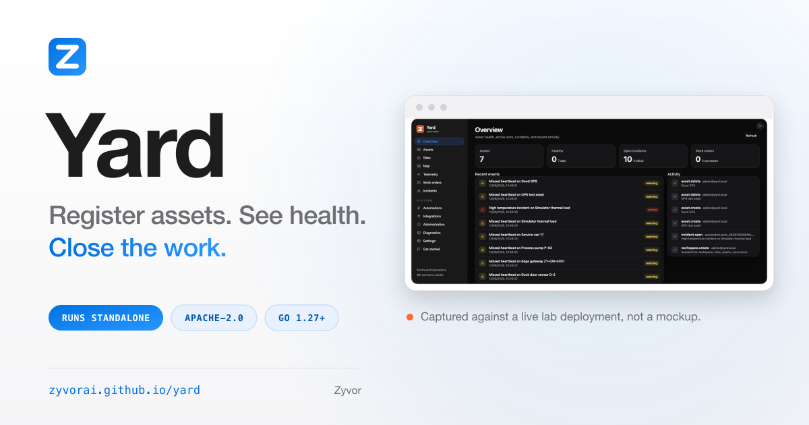

<div align="center">

<picture>
  <source media="(prefers-color-scheme: dark)" srcset="docs/social/yard-share-card-dark.png">
  
</picture>

# Yard

### Open asset and operations platform.

Devices, sites, telemetry, incidents and work orders.<br>
Zyvor connectors are optional. **Yard runs alone.**

[](https://github.com/zyvorai/yard/actions/workflows/ci.yml)
[](LICENSE)
[](https://zyvorai.github.io/yard/)
[](go.mod)
[](web/package.json)

[**Quick start**](#quick-start) · [**Product tour**](https://zyvorai.github.io/yard/tour) · [**Compare**](https://zyvorai.github.io/yard/compare) · [**Docs**](docs/index.md) · [**Architecture**](docs/architecture.md)

</div>

---

## One registry for physical operations

Yard is a standalone registry for physical operations. A device is one asset kind; vehicles, machines, sensors, and equipment share the same model. Device Agent, Nodra, Fleet, and OTA plug in when you need them — you can install Yard without installing anything else in the Zyvor suite.

Yard stays honest when data goes quiet: observations carry source, unit, quality, and timestamps; missed heartbeats mark assets **stale** rather than healthy; automations open incidents with severity policies and runbooks so operators know what to do next.

<div align="center">


</div>

<table>
<tr>
<td valign="top" width="33%">
<b>Registry and map</b><br>
Devices, vehicles, machines, sensors and equipment share one model. CSV/JSON import-export and a clustered MapLibre map.<br>
<a href="docs/features.md#registry-map-and-bulk-io">Registry</a>
</td>
<td valign="top" width="33%">
<b>Telemetry you can trust</b><br>
Observations carry source, unit, quality and timestamps. Missed heartbeats mark assets stale, not healthy.<br>
<a href="docs/features.md#live-ops-and-automations">Live ops</a>
</td>
<td valign="top" width="33%">
<b>Incidents and runbooks</b><br>
A threshold or stale automation opens an incident. The highest-priority severity policy attaches its runbook.<br>
<a href="docs/features.md#incidents-severity-policies-and-runbooks">Incidents</a>
</td>
</tr>
<tr>
<td valign="top" width="33%">
<b>Automations</b><br>
Threshold, capability-range or stale triggers open an incident, notify, or call a webhook, Slack, email or PagerDuty.<br>
<a href="docs/features.md#live-ops-and-automations">Automations</a>
</td>
<td valign="top" width="33%">
<b>Work orders</b><br>
Inspections, repairs, installations and maintenance, assigned and closed with a recorded resolution.<br>
<a href="docs/features.md#what-yard-does">What Yard does</a>
</td>
<td valign="top" width="33%">
<b>Users, roles and keys</b><br>
Viewer, operator and admin roles; per-person API keys; rate-limited logins. An unknown role fails closed to read-only.<br>
<a href="docs/features.md#users-roles-and-api-keys">Access</a>
</td>
</tr>
</table>

## Dashboard gallery

Live UI captures from a lab deployment — not mockups. Full tour: [Product tour](https://zyvorai.github.io/yard/tour) · [Console features](https://zyvorai.github.io/yard/docs/guides/console).

<table>
<tr>
<td width="33%"><br><sub>Assets — search, kinds, health, bulk import/export</sub></td>
<td width="33%"><br><sub>Sites — factories, warehouses, locations</sub></td>
<td width="33%"><br><sub>Map — MapLibre full-bleed with clustered pins</sub></td>
</tr>
<tr>
<td width="33%"><br><sub>Telemetry — freshness, quality, sparklines</sub></td>
<td width="33%"><br><sub>Work orders — inspections, repairs, maintenance</sub></td>
<td width="33%"><br><sub>Automations — threshold and stale rules</sub></td>
</tr>
</table>

## Quick start

```bash
go run ./cmd/yard
```

Open [http://127.0.0.1:8080](http://127.0.0.1:8080). The default mode is `demo`, with the login `admin@yard.local` / `yard-admin`. Production refuses that login: set `YARD_MODE=production`, `YARD_PUBLIC_URL`, `YARD_SECRET_KEY`, and on an empty database `YARD_BOOTSTRAP_EMAIL` and `YARD_BOOTSTRAP_PASSWORD` ([SECURITY.md](SECURITY.md)).

In another terminal, start the included telemetry simulator:

```bash
export YARD_SIMULATOR_TOKEN=$(cat data/simulator.token)
go run ./cmd/simulator
```

Or run with Docker: `docker compose up --build`. Needs Go 1.27+ and Node 20+; SQLite is built in (no CGO), Postgres is optional. Docker Compose, remote lab deploy, backups and the Device Agent gateway: [Getting started](docs/getting-started.md).

## Boundaries

Yard owns the operations surface. Everything else stays where it lives.

| Component | Responsibility |
| --- | --- |
| **Yard** | Asset registry, sites, workflows, incidents, shared UI |
| **Device Agent** | Hardware discovery, health, local diagnostics |
| **Nodra connector** | Pull decoded telemetry / twins into ingest |
| **Zyvor Fleet connector** | Lifecycle / rollout / OTA-device progress |
| **OTA connector** | Campaign list display; execution stays elsewhere |
| **HTTP / simulator** | Zero-dependency evaluation path |

Device Agent reports physical capability. Nodra interprets protocols. Fleet owns desired state. Optional connectors sync when an endpoint and a stored secret are set. Full contracts: [docs/CONNECTORS.md](docs/CONNECTORS.md).

## Go deeper

- <a id="what-yard-does"></a><a id="live-ops-and-automations"></a><a id="registry-map-and-bulk-io"></a><a id="incidents-severity-policies-and-runbooks"></a><a id="users-roles-and-api-keys"></a>**Features:** modules, live ops and automations, registry and map, incidents and runbooks, users, roles and API keys — [docs/features.md](docs/features.md).
- <a id="architecture"></a><a id="repository"></a><a id="data-model"></a>**Architecture:** component diagram, repository map and data model — [docs/architecture.md](docs/architecture.md).
- <a id="contents"></a><a id="prerequisites"></a><a id="docker-compose"></a><a id="remote-lab-deploy"></a><a id="backups"></a><a id="device-agent-gateway"></a>**Prerequisites and deploy:** [docs/getting-started.md](docs/getting-started.md).
- <a id="interface"></a><a id="tests"></a>**Interface and tests:** [docs/interface-and-tests.md](docs/interface-and-tests.md).

<a id="docs-and-roadmap"></a>

## Docs and roadmap

| Resource | Link |
| --- | --- |
| Documentation index | [docs/index.md](docs/index.md) |
| Product docs | [zyvorai.github.io/yard](https://zyvorai.github.io/yard/) |
| Compare | [Yard Core vs. Zyvor Enterprise](https://zyvorai.github.io/yard/compare) |
| Feature catalog | [docs/ROADMAP.md](docs/ROADMAP.md) |
| Programs 1–16 | [docs/PHASES.md](docs/PHASES.md) |
| OpenAPI · SDKs | [openapi.yaml](openapi.yaml) · [sdk/](sdk/) — Go and TypeScript |
| Security | [SECURITY.md](SECURITY.md) · [docs site](https://zyvorai.github.io/yard/docs/security) |

## License

### Open source (Apache-2.0)

This repository is licensed under the [Apache License, Version 2.0](LICENSE).
You may use, modify, and run it for personal, lab, and commercial production
use at no charge, subject to Apache-2.0 (preserve notices / NOTICE where required).

### Enterprise

Production support, SLAs, and Zyvor Enterprise products are licensed separately.
Contact [sales@zyvor.dev](mailto:sales@zyvor.dev) or see [zyvor.dev](https://zyvor.dev).
