<div align="center">

# Yard

[](https://github.com/zyvorai/yard/actions/workflows/ci.yml)
[](LICENSE)
[](https://zyvorai.github.io/yard/)
[](go.mod)
[](web/package.json)

[](https://zyvor.dev/schedule?utm_source=github&utm_medium=yard&utm_campaign=readme_hero)
[](https://zyvor.dev/poc?utm_source=github&utm_medium=yard&utm_campaign=readme_hero)
[](#quickstart)

[**Quickstart**](#quickstart) · [**Product tour**](https://zyvorai.github.io/yard/tour) · [**Compare**](https://zyvorai.github.io/yard/compare) · [**Docs**](docs/index.md) · [**Architecture**](docs/architecture.md)

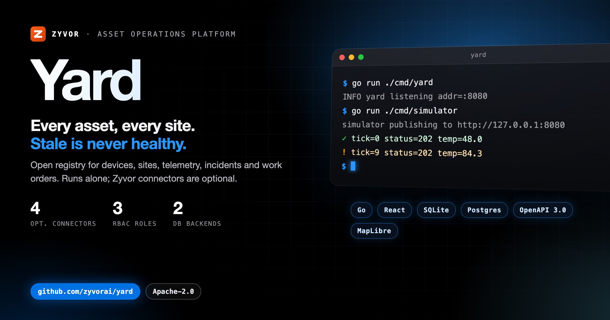

### Every asset, every site. Stale is never healthy.

**Open asset and operations platform.** Devices, sites, telemetry, incidents and work orders in one registry, one Go binary and one embedded console. Zyvor connectors are optional. **Yard runs alone.**

**One asset model** · **Stale, never healthy** · **Incidents with runbooks** · **3 roles, per-person API keys** · **SQLite or Postgres**

</div>

---

## What's new

Recent work on `main` (see the [programs page](docs/PHASES.md) for the full status):

| Area | What shipped |
|---|---|
| Telemetry ingest | Prometheus remote write, OTLP JSON and MQTT (`YARD_MQTT_URL`) next to HTTP ingest |
| Typed observations | Number, integer, counter, bool, text, json, ref, enum, event and histogram values with sequence and quality metadata |
| Storage | Hourly rollups for numeric rows older than 24 hours, admin retention, optional TimescaleDB hypertables |
| Smarter thresholds | A threshold holds until it stays true, and noise inside a band is ignored (debounce, hysteresis, flap counts) |
| Field work | Parts and labor on work orders, and field work that can finish offline |
| Releases | Tagged amd64 and arm64 binaries with checksums and build info |

## Why Yard

Yard is a standalone registry for physical operations. A device is one asset kind; vehicles, machines, sensors, and equipment share the same model. Device Agent, Nodra, Fleet, and OTA plug in when you need them — you can install Yard without installing anything else in the Zyvor suite.

Yard stays honest when data goes quiet: observations carry source, unit, quality, and timestamps; missed heartbeats mark assets **stale** rather than healthy; automations open incidents with severity policies and runbooks so operators know what to do next.

| When this happens… | Yard gives you… |
|---|---|
| Devices, vehicles and machines live in different spreadsheets and tools | One asset model for every kind, placed on sites and a clustered map, with CSV/JSON import and export |
| A sensor goes quiet and the dashboard still shows green | A background stale ticker: missed heartbeats mark assets **stale**, not healthy |
| An alert fires and nobody knows what to do next | Automations open incidents, and the highest-priority severity policy attaches its runbook |
| The fix happens, but the record of it doesn't | Work orders for inspections, repairs, installations and maintenance, closed with a recorded resolution on the asset timeline |
| Telemetry values arrive with no context | Observations that carry source, unit, quality and timestamps |
| Operations tools need to talk to the rest of your stack | Webhook, Slack, email and PagerDuty actions, OpenAPI 3.0 with Go and TypeScript SDKs, and optional Zyvor connectors |

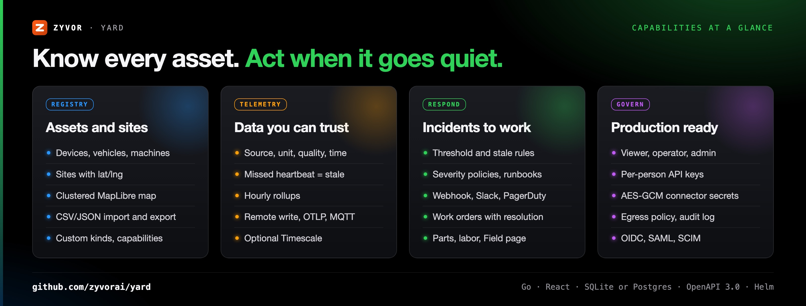

<table>
<tr>
<td valign="top" width="33%">
<b>Registry and map</b><br>
Devices, vehicles, machines, sensors and equipment share one model. CSV/JSON import-export and a clustered MapLibre map.<br>
<a href="docs/features.md#registry-map-and-bulk-io">Registry</a>
</td>
<td valign="top" width="33%">
<b>Telemetry you can trust</b><br>
Observations carry source, unit, quality and timestamps. Missed heartbeats mark assets stale, not healthy.<br>
<a href="docs/features.md#live-ops-and-automations">Live ops</a>
</td>
<td valign="top" width="33%">
<b>Incidents and runbooks</b><br>
A threshold or stale automation opens an incident. The highest-priority severity policy attaches its runbook.<br>
<a href="docs/features.md#incidents-severity-policies-and-runbooks">Incidents</a>
</td>
</tr>
<tr>
<td valign="top" width="33%">
<b>Automations</b><br>
Threshold, capability-range or stale triggers open an incident, notify, or call a webhook, Slack, email or PagerDuty.<br>
<a href="docs/features.md#live-ops-and-automations">Automations</a>
</td>
<td valign="top" width="33%">
<b>Work orders</b><br>
Inspections, repairs, installations and maintenance, assigned and closed with a recorded resolution.<br>
<a href="docs/features.md#what-yard-does">What Yard does</a>
</td>
<td valign="top" width="33%">
<b>Users, roles and keys</b><br>
Viewer, operator and admin roles; per-person API keys; rate-limited logins. An unknown role fails closed to read-only.<br>
<a href="docs/features.md#users-roles-and-api-keys">Access</a>
</td>
</tr>
</table>

---

## Yard vs ThingsBoard

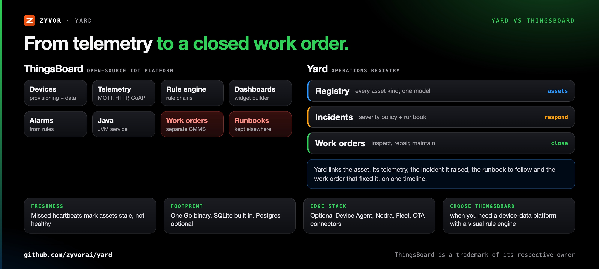

| | **Yard** | **ThingsBoard** (open-source IoT platform) |
|---|---|---|
| Centre of gravity | The asset and the operations work around it | Device connectivity, telemetry and dashboards |
| Asset model | Devices, vehicles, machines, sensors and equipment in one model, placed on sites | Devices and assets with relations |
| Data quality | Every observation carries source, unit, quality and timestamps; missed heartbeats mark assets stale | Time-series telemetry and attributes |
| Response | Automations open incidents; severity policies attach runbooks | Rule chains raise alarms and trigger actions |
| Maintenance | Work orders, parts and labor, Field page, recorded resolution | Not the focus; work orders usually live in a separate CMMS |
| Footprint | One Go binary with an embedded console; SQLite built in, Postgres optional | Java service with its own database setup |
| Edge integration | Optional Device Agent, Nodra, Fleet and OTA connectors | Its own gateway and device protocols (MQTT, HTTP, CoAP and more) |
| **Choose ThingsBoard when** | | Your main need is a device-data platform with protocol breadth, a visual rule engine and a dashboard builder |

Yard owns the operations surface and stays out of protocol decoding and desired state; see [How it fits together](#how-it-fits-together).

---

## See it live

Live UI captures from a lab deployment — not mockups. Full tour: [Product tour](https://zyvorai.github.io/yard/tour) · [Console features](https://zyvorai.github.io/yard/docs/guides/console).

<div align="center">

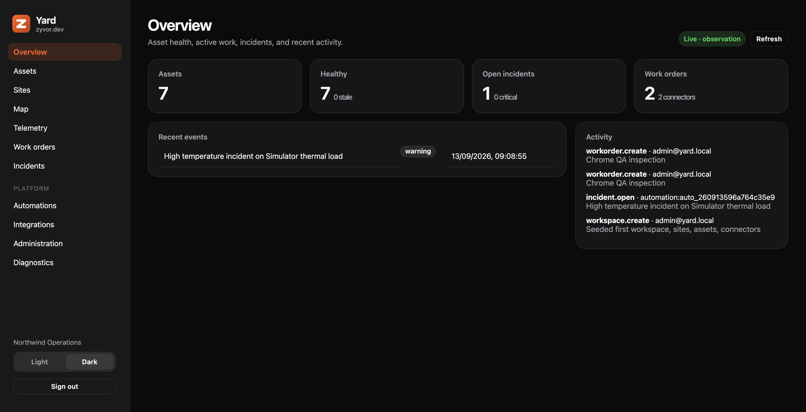

</div>

<table>
<tr>
<td width="33%">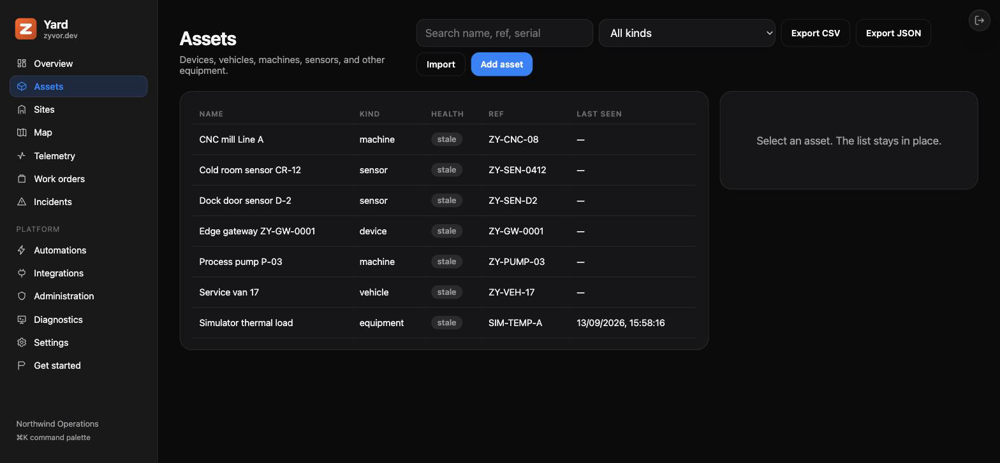<br><sub>Assets — search, kinds, health, bulk import/export</sub></td>
<td width="33%">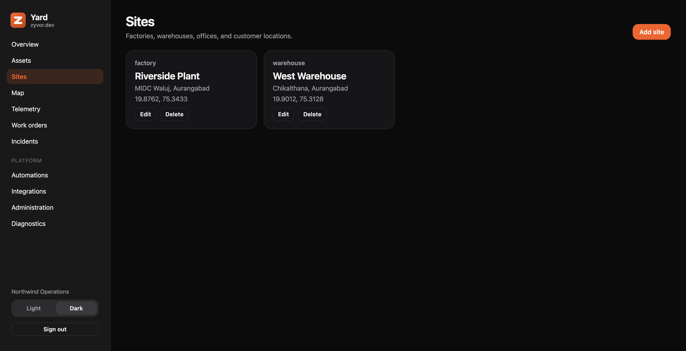<br><sub>Sites — factories, warehouses, locations</sub></td>
<td width="33%">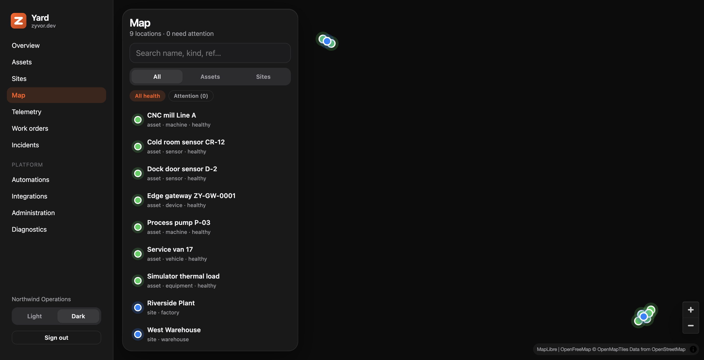<br><sub>Map — MapLibre full-bleed with clustered pins</sub></td>
</tr>
<tr>
<td width="33%">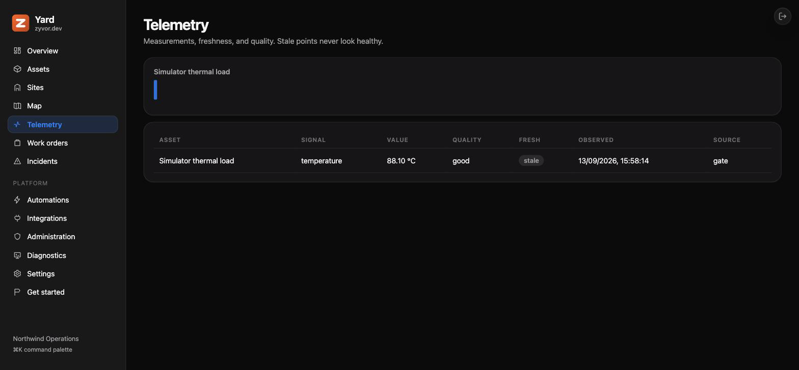<br><sub>Telemetry — freshness, quality, sparklines</sub></td>
<td width="33%">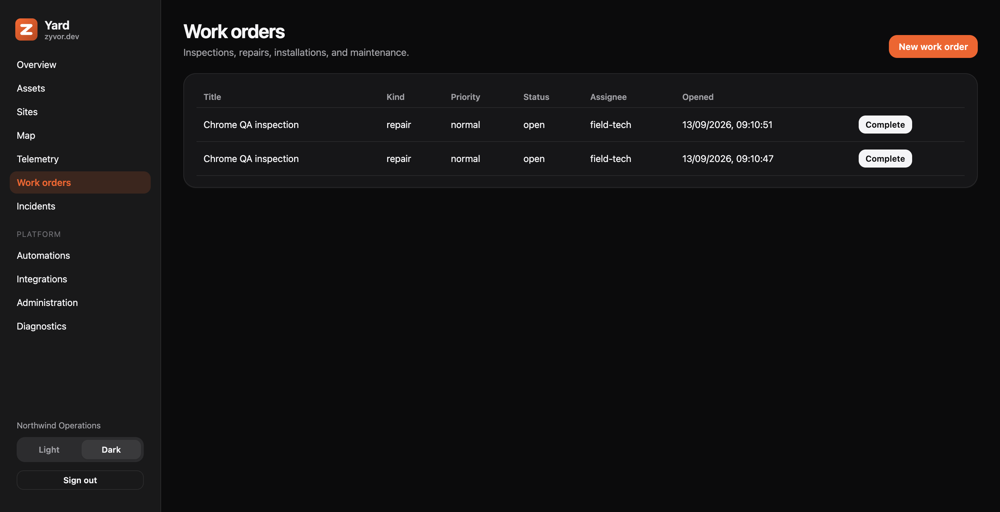<br><sub>Work orders — inspections, repairs, maintenance</sub></td>
<td width="33%">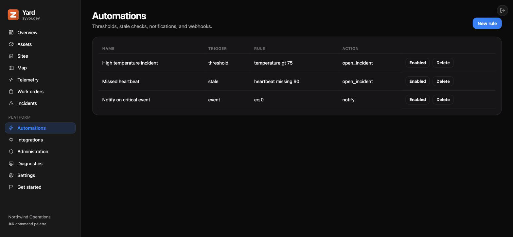<br><sub>Automations — threshold and stale rules</sub></td>
</tr>
</table>

---

## How it fits together

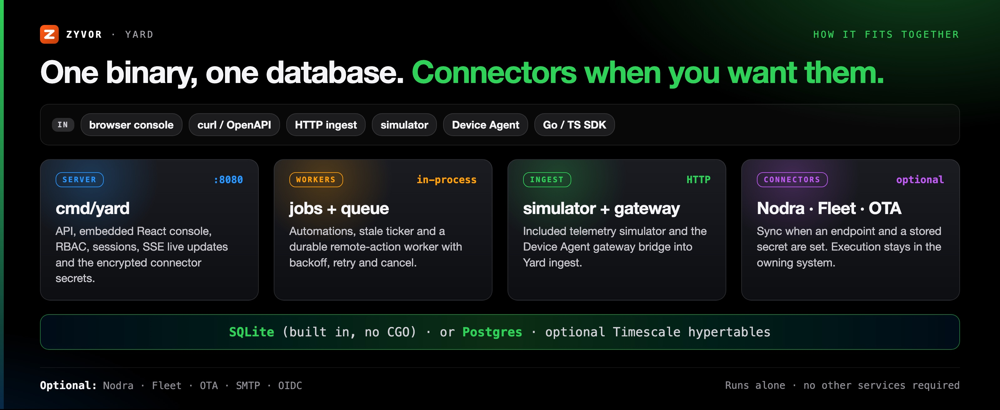

Yard owns the operations surface. Everything else stays where it lives.

| Component | Responsibility |
| --- | --- |
| **Yard** | Asset registry, sites, workflows, incidents, shared UI |
| **Device Agent** | Hardware discovery, health, local diagnostics |
| **Nodra connector** | Pull decoded telemetry / twins into ingest |
| **Zyvor Fleet connector** | Lifecycle / rollout / OTA-device progress |
| **OTA connector** | Campaign list display; execution stays elsewhere |
| **HTTP / simulator** | Zero-dependency evaluation path |

Device Agent reports physical capability. Nodra interprets protocols. Fleet owns desired state. Optional connectors sync when an endpoint and a stored secret are set. Full contracts: [docs/CONNECTORS.md](docs/CONNECTORS.md). Component diagram, repository map and data model: [docs/architecture.md](docs/architecture.md).

---

<a id="quick-start"></a>

## Quickstart

```bash
go run ./cmd/yard
```

Open [http://127.0.0.1:8080](http://127.0.0.1:8080). The default mode is `demo`, with the login `admin@yard.local` / `yard-admin`. Production refuses that login: set `YARD_MODE=production`, `YARD_PUBLIC_URL`, `YARD_SECRET_KEY`, and on an empty database `YARD_BOOTSTRAP_EMAIL` and `YARD_BOOTSTRAP_PASSWORD` ([SECURITY.md](SECURITY.md)).

In another terminal, start the included telemetry simulator:

```bash
export YARD_SIMULATOR_TOKEN=$(cat data/simulator.token)
go run ./cmd/simulator
```

Or run with Docker: `docker compose up --build`. Needs Go 1.27+ and Node 20+; SQLite is built in (no CGO), Postgres is optional. Docker Compose, remote lab deploy, backups and the Device Agent gateway: [Getting started](docs/getting-started.md).

## Go deeper

- <a id="what-yard-does"></a><a id="live-ops-and-automations"></a><a id="registry-map-and-bulk-io"></a><a id="incidents-severity-policies-and-runbooks"></a><a id="users-roles-and-api-keys"></a>**Features:** modules, live ops and automations, registry and map, incidents and runbooks, users, roles and API keys — [docs/features.md](docs/features.md).
- <a id="architecture"></a><a id="repository"></a><a id="data-model"></a>**Architecture:** component diagram, repository map and data model — [docs/architecture.md](docs/architecture.md).
- <a id="contents"></a><a id="prerequisites"></a><a id="docker-compose"></a><a id="remote-lab-deploy"></a><a id="backups"></a><a id="device-agent-gateway"></a>**Prerequisites and deploy:** [docs/getting-started.md](docs/getting-started.md).
- <a id="interface"></a><a id="tests"></a>**Interface and tests:** [docs/interface-and-tests.md](docs/interface-and-tests.md).

<a id="docs-and-roadmap"></a>

## Docs and roadmap

| Resource | Link |
| --- | --- |
| Documentation index | [docs/index.md](docs/index.md) |
| Product docs | [zyvorai.github.io/yard](https://zyvorai.github.io/yard/) |
| Compare | [Yard Core vs. Zyvor Enterprise](https://zyvorai.github.io/yard/compare) |
| Feature catalog | [docs/ROADMAP.md](docs/ROADMAP.md) |
| Programs 1–16 | [docs/PHASES.md](docs/PHASES.md) |
| OpenAPI · SDKs | [openapi.yaml](openapi.yaml) · [sdk/](sdk/) — Go and TypeScript |
| Security | [SECURITY.md](SECURITY.md) · [docs site](https://zyvorai.github.io/yard/docs/security) |

---

## Maturity

Yard tracks its scope as sixteen programs, each marked **Have**, **Partial** or **Planned** in [docs/PHASES.md](docs/PHASES.md), with a Have / Partial / Later feature catalog in [docs/ROADMAP.md](docs/ROADMAP.md).

| Mode | What it means |
|---|---|
| `YARD_MODE=demo` (default) | Seeded sample workspace and the public demo login, for evaluation |
| `YARD_MODE=production` | Refuses to start without `YARD_PUBLIC_URL` and `YARD_SECRET_KEY`, refuses the demo login, inserts no sample data |
| Zyvor connectors | Opt-in: sync only when an endpoint and a stored secret are set |

---

## Part of the Zyvor stack

| Product | Role next to Yard |
|---|---|
| **Yard** | Asset registry, sites, telemetry, incidents and work orders |
| **[Zyvor Device Agent](https://github.com/zyvorai/zyvor-device-agent)** | Hardware discovery, health and local diagnostics; reaches Yard through the Device Agent gateway |
| **[Nodra](https://github.com/zyvorai/nodra)** | Edge runtime that interprets protocols; the Nodra connector pulls decoded telemetry and twins into Yard |
| **[Fleet](https://github.com/zyvorai/zyvorai-fleet)** | Owns desired state; the Fleet connector shows lifecycle, rollout and OTA-device progress |
| **[Zyvor OTA](https://github.com/zyvorai/ota)** | Signed device updates; the OTA connector lists campaigns while execution stays in OTA |

→ [zyvor.dev](https://zyvor.dev)

---

## License

Yard is **free and open source** under the [Apache License, Version 2.0](LICENSE).
You may use, modify, and run it for personal, lab, and commercial production
use at no charge, subject to Apache-2.0 (preserve notices / [NOTICE](NOTICE) where required).

**Zyvor Enterprise** adds what production teams ask for: supported releases, deployment and upgrade guidance, priority incident triage, a named technical contact and 24x7 critical intake. Production support, SLAs, and Zyvor Enterprise products are licensed separately. Plans and terms: [docs/SUBSCRIPTION-MODEL.md](docs/SUBSCRIPTION-MODEL.md) · [Pricing](https://zyvor.dev/pricing?utm_source=github&utm_medium=yard&utm_campaign=readme_license) · [sales@zyvor.dev](mailto:sales@zyvor.dev).

Report vulnerabilities per [SECURITY.md](SECURITY.md). Contributions: [CONTRIBUTING.md](CONTRIBUTING.md).

---

<div align="center">

### Put every asset, incident and work order in one place

[](https://zyvor.dev/schedule?utm_source=github&utm_medium=yard&utm_campaign=readme_footer)
[](https://zyvor.dev/poc?utm_source=github&utm_medium=yard&utm_campaign=readme_footer)
[](https://zyvor.dev/pricing?utm_source=github&utm_medium=yard&utm_campaign=readme_footer)
[](mailto:sales@zyvor.dev?subject=Yard)
[](https://github.com/zyvorai/yard)

</div>
