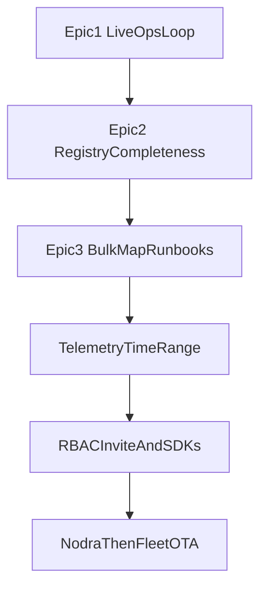

# Yard roadmap

Yard is Zyvor’s open **asset and operations** platform. The core object is
the **asset**. Device Agent, Nodra, Fleet, and OTA remain optional
connectors — Yard must stay useful alone.

This document is the product feature catalog and prioritized Next lane.
Statuses: **Have** (shipped) · **Next** (scheduled) · **Later** (deferred).

## Shipped epics

### Epic 1 — Live ops loop ✅

Make health and incidents feel live without refreshing Overview.

- ~~Background stale ticker in the Yard process~~ **Have**
- ~~Subscribe the console to `GET /api/v1/stream` (SSE)~~ **Have**
- ~~Live Overview counters and Map pin health updates~~ **Have**
- ~~Optional browser notification for new critical incidents~~ **Have**

### Epic 2 — Registry completeness ✅

Close the gap between API and console for day-to-day registry work.

- ~~Create / edit asset UI~~ **Have**
- ~~Fill Asset detail **Activity** and **Work** tabs~~ **Have**
- ~~Site edit / delete~~ **Have**
- ~~Standalone work-order create UI~~ **Have**

### Epic 3 — Bulk ops, map scale, incident playbooks ✅

- ~~Bulk asset import/export (CSV/JSON)~~ **Have**
- ~~MapLibre pin clustering~~ **Have**
- ~~Incident severity policies + runbooks~~ **Have**

Earlier follow-ons in the same lane: automation create/delete + webhook
action, telemetry sparklines, write RBAC, `/metrics`, ingest rate limit,
OpenAPI expand, onboarding, command palette, tablet nav.

---

## 1. Asset registry

| Feature | Status |
| --- | --- |
| Asset list with search / kind / health filters | Have |
| Asset detail (overview + recent telemetry) | Have |
| Create asset via API | Have |
| Create asset UI form | Have |
| Edit / archive / delete asset | Have |
| Asset kinds: device, sensor, machine, vehicle, equipment (+ custom) | Have |
| Capabilities (signals, units, thresholds, writable) | Have (model + UI editor) |
| External refs + manufacturer / model / serial / metadata | Have |
| Asset relationships (parent/child, install history) | Later |
| Bulk import/export (CSV/JSON) | Have (`/api/v1/assets/export`, `/import` + Assets UI) |
| Asset barcode / QR / NFC identity | Later |
| Spare parts / BOM linked to asset | Later |
| Warranties, purchase date, depreciation | Later |
| Documents / photos / manuals attached to asset | Later |
| Asset templates / catalogs | Later |

## 2. Sites and geography

| Feature | Status |
| --- | --- |
| Site list + create | Have |
| Lat/lng on sites and assets | Have |
| MapLibre full-bleed map, filters, detail card, dark basemap | Have |
| Site edit / delete | Have |
| Site hierarchy (campus → building → floor → zone) | Later |
| Geofences + enter/exit events | Later |
| Indoor maps / floorplans | Later |
| Clustering at large pin counts | Have (MapLibre cluster layers) |
| Directions / routing between sites | Later (logistics) |
| Address geocoding | Later |

## 3. Telemetry and health

| Feature | Status |
| --- | --- |
| HTTP ingest observations (dedupe, quality, source, timestamps) | Have |
| Inventory ingest → upsert asset + capabilities | Have |
| Health derivation (temp / heartbeat / quality) | Have |
| Stale marking + missed-heartbeat incidents | Have |
| Background stale ticker | Have |
| Telemetry latest table | Have |
| Historical charts / sparklines / time-range query | Have |
| Multi-signal dashboards per asset | Have |
| Capability min/max enforcement + soft/hard alarms | Have (`capability_min`/`capability_max` automation triggers) |
| Metric retention / downsampling | Later |
| Anomaly detection | Later |
| Export telemetry (CSV, Prometheus, OTLP) | Later |

## 4. Incidents and work orders

| Feature | Status |
| --- | --- |
| Open / ack / assign / resolve incidents | Have |
| Auto-open from threshold + stale automations | Have |
| Create work order from incident | Have |
| Work order list + mark done | Have |
| Work order create UI (standalone) | Have |
| Richer priorities / due dates / assignees UI | Have |
| Incident severity policies + runbooks | Have (Admin policies; runbook on incident detail) |
| SLA timers / escalation | Later |
| Checklists / procedures on work orders | Later |
| Parts used + time tracking | Later |
| Mobile field tech mode (PWA) | Later |
| Multi-asset work orders | Later |
| Calendar / preventive maintenance schedules | Later |

## 5. Automations and actions

| Feature | Status |
| --- | --- |
| List + enable/disable automations | Have |
| Threshold → open incident | Have |
| Stale heartbeat → open incident | Have |
| Notify-on-event automation | Have (notify + audit) |
| Automation rule editor | Have (create / enable / delete) |
| Webhook / email / Slack / PagerDuty actions | Have (email/Slack/PagerDuty implemented, unverified — no test account) |
| Remote actions with idempotency + expiry | Have (API + UI history + sweeper) |
| Device Agent `inventory.refresh` / `diagnostics.read` | Have |
| Two-person action approval | Later |
| Multi-step playbooks | Later |

## 6. Integrations and connectors

| Feature | Status |
| --- | --- |
| HTTP ingest connector + token rotate | Have |
| Included simulator | Have |
| Device Agent gateway + console actions | Have |
| Connector catalog UI | Have |
| Nodra decoded telemetry ingest | Later (catalog today) |
| Zyvor Fleet lifecycle / desired-state display | Later |
| OTA campaign list / update delegate (display) | Later |
| MQTT adapter → HTTP ingest | Later |
| Webhook egress (Yard → customer systems) | Have |
| Complete OpenAPI + SDKs | Have (OpenAPI) / Next (SDKs) |
| OPC-UA / Modbus | Boundary (Nodra) |
| SAP / Maximo / ServiceNow sync | Later |
| OAuth / mTLS for connectors | Later |

See also [CONNECTORS.md](./CONNECTORS.md).

## 7. Realtime and overview

| Feature | Status |
| --- | --- |
| Overview health / incidents / work / activity | Have |
| SSE stream API | Have |
| UI subscribe to SSE | Have |
| Onboarding wizard (`/onboarding`) | Have |
| Global command palette | Have |
| Browser notifications for critical incidents | Have |
| Customizable overview widgets | Later |
| Multi-workspace switcher | Later |

## 8. Administration, security, tenancy

| Feature | Status |
| --- | --- |
| Login sessions (bcrypt) | Have |
| Audit log + Admin token rotate | Have |
| Severity policy editor (Admin) | Have |
| Org-scoped queries / isolation tests | Have |
| Roles / RBAC (viewer, operator, admin) | Have (write gate + invite UX) |
| Invite users / password reset | Have |
| API keys for humans vs connectors | Have |
| SSO (OIDC/SAML) | Later |
| Multi-tenant product UX | Later |
| Soft-delete + retention | Later |
| Secrets vault for connector credentials | Later |
| Compliance exports | Later |

## 9. UX / product surfaces

| Feature | Status |
| --- | --- |
| Apple-inspired light UI + Zyvor mark | Have |
| Dark theme toggle | Have |
| Map full-bleed glass UI | Have |
| Asset Activity / Work / Integrations tabs filled | Have (Activity / Work) |
| Empty states + first-run guided demo | Have |
| Accessibility audit (WCAG) | Next (focus-visible rings fixed; full audit pending) |
| Responsive / tablet field layout | Have (bottom nav) |
| i18n | Later |
| Printable WO / incident reports | Later |
| Saved views / filters | Later |

## 10. Platform, data, deploy

| Feature | Status |
| --- | --- |
| SQLite local / CI | Have |
| Postgres DSN path | Have |
| Docker Compose + ship scripts | Have |
| Backups / restore tooling | Have (`scripts/backup.sh`/`restore.sh`, SQLite + Postgres) |
| Metrics (`/metrics`) + structured logging | Have |
| Rate limits on ingest | Have |
| Migration versioning | Have (`schema_migrations` + versioned migration runner) |
| PostGIS for map queries | Later |
| Horizontal replicas + shared Postgres | Later |
| Helm / k8s deploy | Later |
| Multi-region | Later |

## 11. Logistics extension (deferred)

Keep off the core model until explicitly requested:

- Routes, stops, ETAs, drivers
- Dispatch board / optimization
- Proof of delivery
- Vehicle telematics as a first-class fleet module (vehicle remains an asset kind)

## What Yard will not own

- Protocol decode → **Nodra**
- Desired-state reconciliation → **Zyvor Fleet**
- Firmware execution → **OTA**
- Hypervisor / k8s control plane → **Fabric / Axiom**
- Full CMMS / ERP replacement on day one

Yard stays the **ops surface + registry**. Depth comes from connectors and
the remaining Next-lane items above.
